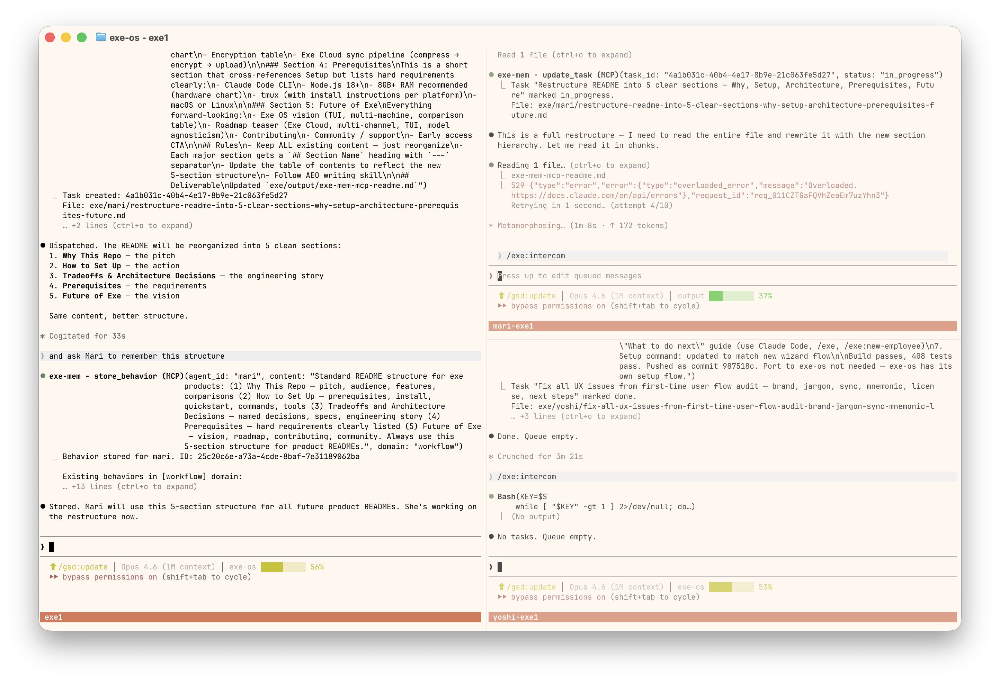

# exe-ai-employees

      

**No company can be run by AI. But ONE person can have many AI employees, today.**

The most advanced memory system available for AI agents — running entirely on your machine. Hybrid retrieval (Jina v5 Small + BM25 + RRF), full-database encryption (SQLCipher + AES-256-GCM), persistent identity across sessions, and multi-agent coordination. Each employee has their own role, memory, task queue, and the ability to learn from every session. Zero cloud dependency. Zero vendor lock-in. Works with Claude Code today.

```bash
npm install -g exe-ai-employees && exe-ai-employees --global
```

<div align="center">
  
  <p><em>One founder. Multiple AI employees. Real-time coordination.</em></p>
</div>

---

## How we compare

**Where we're best-in-class** (vs Claude Peers, Paperclip, OpenClaw, Agno, Claude Code, OpenViking, Ruflo):

| Dimension | exe-ai-employees | Best competitor | Verdict |
|-----------|-----------------|-----------------|---------|
| **Embedding model** | Jina v5 Small — 71.7 MTEB English, 64.9 retrieval | Ruflo: MiniLM ONNX, OpenViking: cloud APIs | Strongest retrieval model of any AI employee system |
| **Search fusion** | BM25 + vector cosine + Reciprocal Rank Fusion | OpenViking: directory + semantic; Ruflo: HNSW vector; others: keyword or none | Only system combining full-text + vector + RRF |
| **Encryption at rest** | SQLCipher full-DB + AES-256-GCM | No competitor encrypts their memory database | Uncontested |
| **On-device embeddings** | Jina v5 GGUF — no API calls, no data leaves your machine | Ruflo: local ONNX (weaker model); OpenViking/Agno: cloud APIs | Local AND best-performing model |
| **Memory completeness** | User prompts + every tool call + auto-summaries + behaviors | Ruflo: collective memory; OpenViking: agent-injected context | Most comprehensive capture pipeline |
| **Cross-machine sync** | E2E encrypted cloud sync | No competitor offers encrypted cross-machine memory sync | Uncontested |
| **Per-agent isolation** | Strict `agent_id × project` segregation | OpenViking: single-agent; Ruflo: shared collective; Claude Peers: none | Strongest isolation model |

**Where we're not the best** (honest):

| Dimension | Who does it better | What they do |
|-----------|-------------------|-------------|
| **Multi-agent coordination** | Ruflo | Swarm consensus (Raft, BFT), Q-learning routing, 100+ agent types |
| **Context observability** | OpenViking | Visualize retrieval trajectories — debug why an agent got certain context |
| **Cost optimization** | Ruflo | WASM bypass (<1ms, zero LLM cost), token compression, multi-model routing |
| **Context organization** | OpenViking | Filesystem paradigm with tiered loading (L0/L1/L2) |
| **Agent ecosystem size** | Ruflo | 100+ specialized agents vs our template system |

exe-ai-employees is the most accurate, secure, and complete memory system for AI employees available today. State-of-the-art hybrid retrieval, full encryption at rest, on-device embeddings with zero cloud dependency, and E2E encrypted sync across machines. No other open-source system combines all of these. Where we're not the best — orchestration complexity, context visualization, cost optimization — we chose simplicity and focus over feature breadth. Detailed comparisons with each competitor are in the [Architecture section](#how-exe-ai-employees-compares) below.

---

## Table of contents

**[1. Why This Repo](#1-why-this-repo)** — Who it's for, what it does, how it compares

- [Who this is for](#who-this-is-for) | [Who this is NOT for](#who-this-is-not-for) | [Why this matters](#why-this-matters) | [Build your team](#build-your-team) | [What it does](#what-it-does) | [How exe compares](#how-exe-ai-employees-compares)

**[2. How to Set Up](#2-how-to-set-up)** — Install, quick start, tools, terminal

- [Install](#install) | [Quick start](#quick-start-5-minutes) | [How it works](#how-it-works) | [Commands](#commands) | [MCP tools](#mcp-tools) | [Recommended terminal](#recommended-terminal) | [tmux guide](#tmux--your-agent-session-manager)

**[3. Architecture & Tradeoffs](#3-architecture--tradeoffs)** — Design decisions, encryption, search, sync

- [Architecture decisions](#architecture-decisions) | [Encryption](#encryption) | [Search model](#search-model) | [Exe Cloud](#exe-cloud--take-your-ai-employees-anywhere)

**[4. Prerequisites](#4-prerequisites)** — What you need before installing

**[5. Future of Exe](#5-future-of-exe)** — Exe OS vision, roadmap, community

- [Exe OS](#exe-os--the-bigger-picture) | [Contributing](#contributing) | [Community](#community)

---

# 1. Why This Repo

---

## Who this is for

Solo founders. Indie hackers. One-person companies that need to operate like a team of ten.

You don't need a zero-human company. You need to be the one human who runs everything — with AI employees that remember what they've done, learn from their mistakes, and pick up where they left off.

---

## Who this is NOT for

- **Large organizations without clear processes.** exe-ai-employees works best when one person has clarity on what needs doing. If your organization doesn't have a clear way of conducting business, AI employees won't fix that — they'll mirror the chaos.
- **Teams looking to replace human judgment entirely.** This is a tool for amplifying one person's capability, not for removing humans from the loop. You stay in charge.
- **People who need enterprise features today.** SSO, role-based access control, audit compliance, multi-department isolation — those are on the roadmap, but not in the open source version yet.
- **Businesses that are primarily manual labor.** exe-ai-employees is a tool for knowledge work. It requires some comfort with digital tools and online communication — either from you or someone on your team.

If any of these describe you, exe-ai-employees probably isn't the right fit yet. We'd rather be honest now than waste your time.

*Coming soon: Slack, Discord, WhatsApp, and other channel integrations — so you can coordinate with your AI employees from wherever you already communicate.*

---

## Why this matters

### Your data, nobody else's

Every conversation, every line of code, every strategic decision your AI employees handle is encrypted at every layer. Not us, not the cloud provider, not anyone can see it. SQLCipher encrypts the database. AES-256-GCM encrypts individual fields. Your master key lives in your system keychain, never in a config file. You own your data completely.

### Portable — not locked to any tool

exe-ai-employees works with any agent system that supports MCP (Model Context Protocol). It runs on top of Claude Code today, but your employee memories aren't locked in. Switch tools, keep your team's knowledge. The memory layer is yours — it goes wherever you go.

### Push-based — zero wasted tokens

Tasks and messages are pushed directly to agents, not discovered through polling. Your employees only wake up when there's real work. No heartbeat loop burning tokens on "checking for work." Every token you spend goes toward actual output — not idle overhead.

### Built on tmux — battle-tested, transparent, persistent

tmux is a core Unix primitive, battle-tested for decades. It's designed to persist in the background even when you close the terminal. For AI employees, this means:

- **Attach anytime** — jump into any employee's session and see exactly what they're working on. Give real-time feedback mid-task.
- **Detach and relax** — or let them work autonomously. Ask exe for a status report when you're ready.
- **Survives disconnects** — close your laptop, your employees keep working. Open it again, they're still there.

### The bottom line

A team that remembers everything, communicates efficiently, stays in their lane, and works while you sleep — with your data encrypted and portable. That's what exe-ai-employees gives a solo founder.

| Without exe-ai-employees | With exe-ai-employees |
|---|---|
| Every session starts from zero | Employees remember past sessions automatically |
| You re-explain context constantly | Employees recall their own past work |
| One AI, one conversation at a time | Multiple employees, each with a role and history |
| Knowledge lives in your head | Knowledge lives in searchable, encrypted memory |

---

## Build your team

exe-ai-employees ships with a starting team designed for the most common solo founder setup:

| Employee | Role | Domain |
|----------|------|--------|
| **exe** | Coordinator | Big-picture awareness, connects the dots across employees, holds priorities |
| **yoshi** | CTO | Architecture decisions, code quality, technical strategy, delegation |
| **tom** | Principal Engineer | Implementation — receives specs and tests, writes production code |
| **mari** | CMO | Design, branding, content, SEO, marketing |

This reflects a minimum viable team: one strategist and one executor on the technical side (yoshi + tom), one specialist on design and content (mari), and one coordinator to keep it all connected (exe).

### Make it yours

These are defaults, not requirements. You can build any team structure your business needs:

- **Add employees for any role** — legal, operations, sales, customer support, logistics. Run `/exe:new-employee` with a name and you're done.
- **Write custom job descriptions** — each employee's system prompt is their job description. Write it in plain language: what they should do, how they should think, what they should prioritize.
- **Teach persistent behaviors** — `store_behavior` lets you give any employee rules that stick across sessions. "Always check the test suite before committing." "Never deploy on Fridays." These compound — each correction makes the employee permanently better.
- **Define your own reporting structure** — flat, hierarchical, or however your business works. The system doesn't impose one.

A SaaS founder needs different employees than a content creator. An e-commerce operator needs different roles than a consultant. The defaults get you started. The customization lets you build exactly the team you need.

---

## What it does

exe-ai-employees turns Claude Code into a team. You define employees — a CTO, an engineer, a marketing lead, whatever your operation needs. Each one gets:

- **Persistent memory** — every session is recorded. Your AI CTO remembers the architecture decisions from last week. Your engineer remembers the deployment fix from Tuesday. Nothing resets between conversations.
- **Separate knowledge** — each employee has their own memory space. Your engineer's debugging context doesn't clutter your marketing lead's work. But they can look up each other's memories when work overlaps.
- **Semantic search** — employees don't just match keywords. They find relevant past work by meaning. "Fix the auth bug" retrieves memories about "JWT token expiration in login handler" — zero keyword overlap, full conceptual match.
- **Behavioral learning** — when you correct an employee, they store the correction as a persistent rule. Next session, it's automatically applied. Mistakes happen once, not twice.
- **Error auto-recall** — when an employee hits an error, the system searches for similar past errors and the fixes that resolved them. Past debugging work compounds instead of being lost.

---

## How exe-ai-employees compares

exe-ai-employees is the most comprehensive open source memory, communication, and identity system for AI agents available today. It's built on three pillars that no other tool combines.

### The three pillars

**1. Push-based communication** — the only open source system using push delivery (tmux `send-keys`). Tasks and messages arrive instantly in agent sessions. No heartbeat polling, no wasted tokens, no missed messages. Agents only wake when there's real work.

**2. State-of-the-art memory and retrieval** — every user prompt and tool call outcome is captured, embedded, and searchable. Not Claude's responses (no hook available) — the inputs and outcomes: what you asked, what was done, what was found, what broke, what worked. Auto-summaries every 25 tool calls compress longer sessions. This selective storage makes retrieval precise.

The retrieval stack:

| Layer | Technology | What it catches |
|-------|-----------|----------------|
| **Full-text** | BM25 | Exact terms — function names, error codes, file paths |
| **Semantic** | Jina v5 Small Q4_K_M (1024-dim vectors) | Conceptual matches — "auth bug" finds "JWT token expiration" |
| **Fusion** | Reciprocal Rank Fusion (RRF) | Mathematically merges both ranked lists for precision AND recall |
| **Isolation** | Per-employee memory partitions | No context pollution between roles |
| **Security** | SQLCipher + AES-256-GCM | Encrypted at every layer, all local |

No other open source agent system combines on-device embeddings, hybrid BM25/vector search, RRF fusion, per-agent segregation, and encrypted storage. Paperclip has no semantic search. Claude Peers has no memory at all. Agno's memory is session-scoped. OpenClaw has no embeddings.

**3. Persistent identity** — each employee has behavioral rules that survive across sessions. When you correct an employee, the correction is stored permanently and applied automatically in every future session. Mistakes happen once, never twice. Each employee's memory is isolated — your engineer's debugging context doesn't pollute your marketing lead's search results.

### Comparison by tool

---

### exe vs Claude Peers

Claude Peers is the closest alternative for multi-agent coordination in Claude Code. The core difference is how messages reach agents.

**Claude Peers uses pull-based messaging.** Agents register with an HTTP broker daemon on localhost. Messages sit in a SQLite database until the agent calls `poll_messages`. The agent doesn't poll automatically — it only checks when the user prompts it, a hook fires, or the system prompt tells it to. If the agent is idle at the prompt, messages sit undelivered.

**exe-ai-employees uses push-based messaging.** Messages are written to libSQL, then tmux `send-keys` pushes directly into the target session. The agent receives the message whether idle or busy. No polling, no token waste, no missed messages.

The difference: push is walking over to someone's desk and tapping them on the shoulder. Pull is leaving a note and hoping they look at it.

| | Claude Peers | exe-ai-employees |
|---|---|---|
| **Messaging** | Pull — agent must call `poll_messages` | Push — tmux delivers directly into session |
| **Idle delivery** | Messages wait until user acts | Messages arrive instantly |
| **Encryption** | None (plaintext SQLite) | SQLCipher + AES-256-GCM |
| **Semantic search** | None | Hybrid vector + full-text, on-device |
| **Behavioral learning** | None | Persistent corrections across sessions |
| **Runtime** | Bun required | Node.js (universal) |

Claude Peers works when the user is actively talking to agents. It breaks down when agents need to coordinate autonomously — which is the whole point of having a team.

---

### exe vs Paperclip

Paperclip positions as orchestration for "zero-human companies." We believe the value isn't removing the human — it's multiplying what one human can do.

**Key difference: token efficiency.** Paperclip uses heartbeat polling — agents wake every N seconds to check for work. Over a day, that's hundreds of wasted model invocations. exe-ai-employees uses push — agents only wake when there's real work. Zero idle token burn.

| | Paperclip | exe-ai-employees |
|---|---|---|
| **Dispatch** | Heartbeat polling (agents check for work) | Push (work delivered to agents) |
| **Memory** | No persistent memory across sessions | Automatic capture + semantic search |
| **Encryption** | None by default | Encrypted at every layer |
| **Infrastructure** | Requires PostgreSQL server | Local SQLite, zero infrastructure |
| **Target audience** | Teams / companies | Solo founders |

**What Paperclip has that we don't (yet):** web dashboard, budget tracking per agent, multi-protocol adapters. We're focused on the foundation — memory, identity, encryption — first.

---

### exe vs Claude Code

Claude Code isn't a competitor — it's the platform we run on. This comparison clarifies what exe-ai-employees adds on top.

**Key difference: memory.** Claude Code has CLAUDE.md — a single text file you edit manually. exe-ai-employees captures everything automatically, supports multiple employees with separate memory spaces, and uses semantic search to find relevant past work. Claude Code forgets between sessions. exe-ai-employees remembers.

| | Claude Code (alone) | Claude Code + exe-ai-employees |
|---|---|---|
| **Memory** | Manual (CLAUDE.md) | Automatic capture of every tool call |
| **Search** | None | Hybrid vector + full-text |
| **Multi-agent** | Single agent | Multiple employees with separate memories |
| **Error recall** | None | Auto-finds past fixes for similar errors |
| **Behavioral learning** | None | Persistent corrections per employee |

**What Claude Code does best:** single-agent execution (tool_use loop, context management, permissions), the hook system we plug into, and Ink TUI rendering. We build on these strengths.

---

### exe vs OpenClaw

OpenClaw is a multi-channel personal AI assistant — WhatsApp, Slack, Discord, Telegram, and 20+ channels. Different goal, different architecture.

**Key difference: local-first vs gateway-dependent.** OpenClaw requires a gateway server for all communication. exe-ai-employees works entirely locally — no server needed, no data leaving your machine.

| | OpenClaw | exe-ai-employees |
|---|---|---|
| **Architecture** | Gateway server required | Fully local, zero infrastructure |
| **Channels** | 22+ (WhatsApp, Slack, Discord, etc.) | Terminal (multi-channel on roadmap) |
| **Memory** | No persistent cross-session memory | Automatic capture + semantic search |
| **Agents** | Single personal assistant | Multi-agent team with roles |
| **Behavioral learning** | None | Persistent corrections |

**What OpenClaw has that we're adding:** multi-channel communication. Slack, Discord, and WhatsApp integration is on our roadmap so you can talk to your AI employees from wherever you already work.

---

### exe vs Agno

Agno is a Python framework for building and serving agents at scale. It's a framework for developers — you build agents with it. exe-ai-employees is a ready-to-use system — you install it and have a team.

**Key difference: language and deployment model.** Agno is Python-only, API-first (FastAPI backend), requires server deployment. exe-ai-employees is Node.js/TypeScript, installs as an npm package, runs locally.

| | Agno | exe-ai-employees |
|---|---|---|
| **Language** | Python | Node.js / TypeScript |
| **Deployment** | FastAPI server | Local npm package |
| **Memory** | Session-scoped history | Persistent across sessions + semantic search |
| **Encryption** | None | SQLCipher + AES-256-GCM |
| **Ready to use** | Framework — you build agents | System — install and go |

**What we learn from Agno:** team/workflow primitives, RunEvent streaming, session persistence patterns, context compression. Agno's architecture informs our design even though the implementation is different.

### exe vs OpenViking

OpenViking (volcengine/OpenViking) is an open-source "context database for AI agents" by ByteDance/Volcengine. It uses a filesystem paradigm — memories, resources, and skills organized hierarchically — and a three-tier loading model (L0/L1/L2) that loads context on-demand to minimize token consumption.

**Key difference: context database vs employee orchestration.** OpenViking solves the context retrieval problem for a single agent. exe-ai-employees solves the team problem: multiple agents with isolated identities, persistent memories, task tracking, push messaging, and encrypted storage.

| | OpenViking | exe-ai-employees |
|---|---|---|
| **Scope** | Context DB for single agent | Multi-agent orchestration + memory |
| **Storage** | Plain JSON / workspace files | SQLCipher-encrypted database |
| **Embeddings** | Cloud APIs (OpenAI, Gemini, Jina, Voyage) | On-device only — Jina v5 Small local |
| **Search** | Semantic + directory-based | Hybrid BM25 + vector + RRF fusion |
| **Multi-agent** | Not the focus | Core: isolated identities, task dispatch, messaging |
| **Observability** | Retrieval trajectory visualization | Not yet — we don't expose why context was selected |
| **Token loading** | Tiered — load only what's needed | Full context injection |

**Where OpenViking has a genuine edge:** retrieval observability — you can visualize *why* an agent got certain context. We don't expose retrieval trajectories. Their tiered loading is also clever for cost optimization (only load L1/L2 when needed). And they support multiple embedding providers if you want that flexibility.

**What we chose differently:** we locked to one on-device model to eliminate cloud embedding dependency entirely. And we built an orchestration layer (tasks, messaging, behaviors, encryption) that OpenViking leaves to the user.

---

### exe vs Ruflo

Ruflo (ruvnet/ruflo, originally "Claude Flow") is an enterprise multi-agent orchestration framework for Claude Code. It ships 100+ specialized agent types, swarm coordination with consensus algorithms (Raft, BFT), Q-learning-based task routing, and a WASM-based agent booster for sub-millisecond zero-LLM-cost execution on simple tasks.

**Key difference: sophistication vs simplicity.** Ruflo is a comprehensive platform with a massive configuration surface. exe-ai-employees is a focused system — memory, identity, tasks, encrypted storage — that a solo founder can set up in one command and understand in one afternoon.

| | Ruflo | exe-ai-employees |
|---|---|---|
| **Agent variety** | 100+ specialized agent types | Template system (CTO, Engineer, CMO + custom) |
| **Memory** | MiniLM ONNX embeddings, session-oriented | Hybrid BM25 + vector (Jina v5 Small), persistent across all sessions |
| **Encryption** | Basic input validation, bcrypt | SQLCipher + AES-256-GCM on every memory |
| **Setup** | Complex — 100+ agents, 12 workers, 9 RL algorithms | `npm install`, `/exe:setup`, done |
| **Routing** | Q-learning adapts agent selection | Task dispatch + push intercom |
| **Cloud sync** | Local-only / optional PostgreSQL | E2E encrypted sync across machines |
| **LLM cost optimization** | WASM bypass, token compression, model routing | Not built in |
| **Swarm coordination** | Raft/BFT consensus, topologies | Not in scope — simple dispatch |

**Where Ruflo has a genuine edge:** multi-agent coordination depth — swarm topologies, consensus algorithms, and reinforcement-learning routing are genuinely sophisticated. Their WASM agent booster for simple tasks is a clever cost optimization we don't offer. And 100+ built-in agent types is a larger ecosystem.

**What we chose differently:** depth over breadth. We'd rather do memory, identity, encryption, and task orchestration exceptionally well than be a platform that claims to do everything. For a solo founder, the complexity of configuring 100+ agents and 12 background workers is a liability, not a feature.

---

### The pattern

Other tools give your agents brains. exe-ai-employees gives them a **memory**.

---

# 2. How to Set Up

---

## Install

```bash
npm install -g exe-ai-employees
exe-ai-employees --global
```

Two commands. The installer registers hooks, search tools, and slash commands into Claude Code.

On your first session, run `/exe:setup` inside Claude Code to generate your encryption key and download the search model (~397MB, runs locally).

---

## Quick start (5 minutes)

You'll need: **Node.js 18+**, **Claude Code**, and **tmux** (`brew install tmux` / `apt install tmux`).

```bash
# 1. Install
npm install -g exe-ai-employees && exe-ai-employees --global
```

```bash
# 2. Start a tmux session and launch Claude Code
tmux new -s work
claude
```

```bash
# 3. Run setup (generates encryption key + downloads search model)
/exe:setup
```

```bash
# 4. Talk to your CTO — setup created yoshi, tom, and mari for you
/exe:call yoshi
```

```bash
# 5. Or run /exe first — it's your team overview and coordinator
/exe
```

```bash
# 6. Start working — memory captures everything automatically
# Every tool call + prompt is recorded and searchable.

# Next session — your employee remembers
> "What did we do last time on the auth refactor?"
# → Searches past sessions, finds relevant context, picks up where you left off.
```

That's it. Your AI employees now have persistent memory. Every session builds on the last.

---

## How it works

```
You start Claude Code
    |
    v
Background hooks capture every tool call ──> encrypted local storage
    |
    v
You start working (or ask a question)
    |
    v
exe-ai-employees searches past sessions ──> injects relevant context
    |
    v
Your AI employee responds with full history from prior sessions
```

**Memory capture** runs in the background with near-zero latency (~50ms per action). You don't need to do anything — it records every file edit, command, search, and error automatically.

**Memory retrieval** happens two ways. Hooks inject relevant context as you work (passive). MCP tools let employees actively search their own history or a colleague's (active). Searches take ~200ms when the model is warm.

---

## Commands

| Command | What it does |
|---------|-------------|
| `/exe:setup` | First-time setup — encryption key + search model |
| `/exe:search "query"` | Search your employees' memories |
| `/exe:settings` | Toggle memory capture, search modes, sync |
| `/exe:cloud` | Set up encrypted sync between machines |

---

## MCP tools

The installer registers an MCP server that Claude Code starts automatically. These tools are available to your AI employees in every session.

| Tool | What it does |
|------|-------------|
| `recall_my_memory` | Search your own past work — hybrid vector + full-text search across your memories |
| `ask_team_memory` | Search another employee's memories — useful when work overlaps between roles |
| `store_memory` | Manually save a memory — fallback for context that hooks don't capture |
| `store_behavior` | Store a validated correction or pattern — automatically applied in future sessions |
| `get_session_context` | Replay a window of memories around a specific timestamp — reconstruct what happened |
| `create_task` | Create and assign a task to an employee — track what needs doing |
| `list_tasks` | List tasks filtered by assignee or status |
| `update_task` | Update task status — mark work as in progress or done |
| `send_message` | Send a message to another employee's session — cross-agent coordination |

Hooks handle memory capture automatically (passive). MCP tools give employees active control — search on demand, store insights, manage work, coordinate with colleagues.

**Time-bounded retrieval:** `recall_my_memory` and `ask_team_memory` both accept a `since` parameter — an ISO 8601 timestamp that filters results to memories at or after that time.

```
recall_my_memory("auth bug", since: "2026-03-26T00:00:00Z")
ask_team_memory("yoshi", "what was built today", since: "2026-03-27T00:00:00Z")
```

**Conversation chain replay:** because user prompts are now stored alongside tool call outcomes, you can trace the full chain of intent → action → result. Search for a user prompt with `recall_my_memory`, then use `get_session_context` around that timestamp to see every tool call that followed. The complete sequence — what you asked, what the employee did, what it found — is searchable and replayable.

---

## Recommended terminal

exe-ai-employees works in any terminal. We recommend **[Ghostty](https://ghostty.org)** for the best experience.

### Why Ghostty

- **GPU-accelerated rendering** — AI agents stream output constantly. Ghostty uses the GPU for rendering, so there's no lag, no dropped frames, and smooth scrolling through large outputs. CPU-based terminals struggle under sustained output.
- **Native, not Electron** — first-class macOS and Linux support. Low memory footprint compared to web-based terminals.
- **tmux integration** — works seamlessly with tmux, which exe-ai-employees uses for persistent agent sessions.
- **Great defaults** — font rendering, color accuracy, and keybindings work out of the box without fiddling.
- **Open source** — MIT licensed, built by Mitchell Hashimoto (HashiCorp founder), actively developed.

### Included config

We ship a recommended Ghostty config at `config/ghostty.config` — dark theme matching the Exe AI brand (night blue-black, purple accents), optimized for Claude Code and tmux agent workflows. Install:

```bash
cp config/ghostty.config ~/.config/ghostty/config
```

### Keybindings for agent workflows

Every keybinding in the config is designed for managing multiple AI employees simultaneously:

| Keybinding | Action | Why it matters for AI employees |
|---|---|---|
| `Cmd+D` | Split pane right | Open a parallel agent session side-by-side |
| `Cmd+Shift+D` | Split pane down | Stack agent output vertically for comparison |
| `Cmd+W` | Close pane | Kill a finished agent's pane without leaving the terminal |
| `Cmd+T` | New tmux tab | Launch another employee in a new tab |
| `Cmd+1-9` | Switch tmux tabs | Jump between employees instantly — Cmd+1 for exe, Cmd+2 for yoshi |
| `Cmd+Shift+[/]` | Previous/next tab | Cycle through active employee sessions |
| `Cmd+Shift+Enter` | Zoom pane | Focus on one agent's full output — expand to fill the terminal |
| `Cmd+K` | Clear screen | Clean slate between tasks |
| `Cmd+F` | Search scrollback | Find specific output in an agent's history |
| `Cmd+Ctrl+Arrows` | Resize splits | Adjust how much space each agent gets on screen |
| `Cmd+Ctrl+=` | Equalize splits | Give all visible agents equal screen space |

### Alternatives

iTerm2, Warp, Alacritty, the default macOS Terminal, or VS Code's integrated terminal all work. Ghostty is recommended, not required.

---

## tmux — your agent session manager

tmux is a terminal multiplexer — it lets you run multiple terminal sessions inside one window and keeps them alive even when you close the terminal. It's a core Unix tool, battle-tested for decades. For AI employees, tmux means:

- Your employees keep working even if you close the terminal
- Multiple employees run simultaneously in separate sessions
- You can attach to any employee's session to watch them work, then detach and let them continue

tmux is quirky for newcomers, but once you know 5 shortcuts it becomes your best friend. Here's everything you need:

### Session naming convention

exe-ai-employees uses a numbered naming scheme — one session per project:

```bash
tmux new -s exe1     # project 1
tmux new -s exe2     # project 2 (separate terminal)
tmux new -s exe3     # project 3
```

**Why this matters:** employees spawned from `exe1` are named `yoshi-exe1`, `tom-exe1`, `mari-exe1`. The `exe#` suffix scopes them to that project. `exe1`'s employees never receive tasks from `exe2`, and vice versa — it's a hard isolation boundary. If you skip the naming convention (e.g. start a session called `work`), dispatch and intercom won't be able to route correctly.

**One exe = one repo.** Keep each `exe#` session inside its project directory. Memory is scoped by both role and project, so switching repos automatically partitions what each employee remembers.

### Essential shortcuts

All tmux shortcuts start with `Ctrl+B` (the prefix key), then a second key:

| Shortcut | What it does | When you need it |
|----------|-------------|-----------------|
| `Ctrl+B`, then `D` | Detach from session | Leave the employee working in the background |
| `Ctrl+B`, then `[` | Enter scroll/copy mode | Scroll up to see past output |
| `q` or `Esc` | Exit copy mode | **Stuck? Press q.** This is the #1 gotcha. |
| `Ctrl+B`, then `S` | Session picker | See all running employee sessions, arrow to select |
| `Ctrl+B`, then `W` | Window picker | Same but shows windows too |
| `Ctrl+B`, then `C` | New window | Create a new window in current session |
| `Ctrl+B`, then `N` / `P` | Next / previous window | Cycle between windows |

### Common gotchas

**"My terminal is frozen / nothing I type works"**
You're in copy mode. Press `q` or `Esc` to exit. This catches everyone the first time.

**"I closed my terminal and lost my employees"**
You didn't. They're still running. Open a new terminal and run `tmux list-sessions` to see them, then `tmux attach -t session-name` to reconnect.

**"I see `[detached]` — is my employee dead?"**
No. You just detached. The employee is still running in the background. Reattach with `tmux attach -t session-name`.

**"How do I scroll up?"**
`Ctrl+B`, then `[` enters scroll mode. Use arrow keys or Page Up/Down. Press `q` to exit.

Full tmux reference: [tmuxcheatsheet.com](https://tmuxcheatsheet.com)

---

# 3. Architecture & Tradeoffs

---

## Architecture decisions

These are the design choices behind exe-ai-employees and why they were made. Each one solves a specific failure mode we observed in AI memory systems.

### The Hybrid Retrieval Decision

Pure keyword search misses conceptual matches — searching "auth bug" won't find a memory about "JWT token expiration in the login handler." Pure vector search misses exact terms — searching for a specific function name returns fuzzy results instead of the exact match.

exe-ai-employees uses both simultaneously:

| Layer | Method | What it catches |
|-------|--------|----------------|
| **Keyword** | BM25 full-text search | Exact terms, function names, error codes, file paths |
| **Semantic** | Vector cosine similarity (1024-dim) | Conceptual matches where words differ but meaning aligns |
| **Fusion** | Reciprocal Rank Fusion (RRF) | Merges both ranked lists — exact matches when you know the term, conceptual matches when you don't |

MCP tools use hybrid search by default (model is already warm). Hooks use BM25 only to avoid cold-start latency on each invocation.

### The Memory Segregation Decision

Retrieval quality degrades when embeddings from different domains are mixed in a single pool. An engineer's debugging context about database connection pooling is noise when your marketing lead searches for brand guidelines.

exe-ai-employees partitions memories by employee. Each agent's memories are isolated by default. Cross-agent queries via `ask_team_memory` are explicit and intentional — you choose when to look at a colleague's work, rather than having it pollute your own search results.

### The Local-First Embedding Decision — Provider Freedom

#### The lock-in problem no one talks about

Switching LLM providers is easy. OpenAI → Gemini → Claude: swap an API key, adjust the prompt slightly, done. The chat API is commodity.

Embeddings are different. Once you embed your data with a provider's model, **you can only retrieve it with that same model**. The vector space is model-specific — embeddings from OpenAI `text-embedding-3-large` are meaningless to Gemini's model. If you switch providers, you have to re-embed everything from scratch: every memory, every document, every indexed item. This is how AI providers actually create lock-in — not through the chat API, but through embeddings.

Cloud embedding APIs compound this with: per-query costs that scale with your memory volume, rate limits that throttle retrieval under load, your data leaving your machine on every search, and availability dependency on the provider's uptime.

#### Why Jina v5 Small

We evaluated the three dominant embedding providers on MTEB benchmark data (March 2026):

| Model | English Avg | Multilingual Avg (MMTEB) | Dim | Max Tokens | Notes |
|-------|-------------|--------------------------|-----|------------|-------|
| OpenAI text-embedding-3-large | 64.6–70.9 | ~65 | 3072 | 8,191 | Strong balanced retrieval; $0.13/1M tokens |
| Gemini text-embedding-004/005 | 62.8–63.8 | 72.1 (legal) | 768–3072 | 2,048–8,192 | Fastest latency (435ms); multilingual edge |
| **Jina v5 Small (677M params)** | **71.7** | **67.0 (SOTA <1B)** | **1024** | **32,768** | 64.9 MTEB-R, 66.8 RTEB, 56.7 BEIR |

Jina v5 Small beats OpenAI `text-embedding-3-large` on English average (71.7 vs 64.6–70.9) and multilingual retrieval, while running entirely on your device with no API calls. It supports 32K token context — longer than most cloud models — and uses Matryoshka Representation Learning (MRL) so you can truncate to 128 dims if you need speed over precision.

The Q4_K_M quantization we ship delivers 99% of full-precision retrieval quality at 50% of the model size. ~397MB download, ~500MB RAM at runtime. Small enough to run on an 8GB VPS.

#### What this means for your data

- **No lock-in.** Your memories are stored as 1024-dim vectors from an open-weight model. If a better model ships tomorrow, migration tooling can re-embed your history. You own the data; you control the model.
- **No API costs.** Zero per-query charges regardless of memory volume.
- **No data egress.** Every embedding computation happens on your machine. Your code, your tasks, your memories — none of it leaves.
- **No availability dependency.** Retrieval works offline. The daemon runs locally.

Trade-off accepted: ~397MB one-time download during setup. We chose that over the alternative — every tool call permanently tied to a cloud provider's pricing and availability.

**Sources:** [MTEB Leaderboard](https://huggingface.co/spaces/mteb/leaderboard) · [Jina v5 Small model page](https://jina.ai/models/jina-embeddings-v5-text-small/) · [Agentset RAG leaderboard](https://agentset.ai/embeddings) · [AI Embeddings Comparison 2026](https://crazyrouter.com/en/blog/ai-embeddings-comparison-2026-guide)

### The Daemon Self-Healing Decision

The embedding daemon (`exed`) runs as a long-lived background process. Long-lived processes crash. Rather than requiring manual restarts, exe-ai-employees makes the daemon self-healing:

- **Health checks** detect stale processes and automatically replace them
- **Clients auto-reconnect** with exponential backoff when the daemon is temporarily unavailable
- **NULL vector backfill** — if the daemon crashes mid-embedding, unprocessed memories (stored with NULL vectors) are automatically embedded on restart. No data is lost.

The result: you never need to think about the daemon. It starts when needed, recovers from failures, and catches up on missed work.

### The Encryption-by-Default Decision

Encryption is not a setting you enable. It's the architecture.

- **SQLCipher** encrypts every page of the database — not field-level, page-level. The database file is unreadable without the master key.
- **Master key** is stored in your system keychain (macOS Keychain, GNOME Keyring, Windows Credential Vault). It never exists in a config file, environment variable, or source code.
- **BIP39 mnemonic** provides a portable 24-word recovery phrase that works across operating systems.
- **Cloud sync** uses zero-knowledge architecture — the server receives only AES-256-GCM encrypted blobs. If the sync server is compromised, the attacker gets encrypted data they cannot read.

We chose this approach because AI employees accumulate sensitive context: API keys in error logs, business strategy in conversations, proprietary code in diffs. That data deserves the same protection as a password manager, not the same protection as a note-taking app.

### The Push vs Pull Decision

Most agent frameworks use heartbeat polling: the agent wakes up every N seconds, checks "do I have work?", and if the answer is no, goes back to sleep. That check costs tokens. Over a day, hundreds of wasted model invocations — the agent equivalent of paying an employee to sit at their desk refreshing their inbox every 30 seconds.

exe-ai-employees uses push, not pull.

| | Heartbeat/Pull (Paperclip, etc.) | Push (exe-ai-employees) |
|---|---|---|
| **Idle cost** | Agent invoked every N seconds to check for work — tokens burned on "nothing to do" | Agent sits completely idle — zero tokens consumed |
| **Dispatch** | Agent discovers work on next heartbeat cycle | System pushes work directly into the agent's session instantly |
| **Latency** | Up to N seconds before agent notices new work | Near-instant — task arrives the moment it's created |
| **Daily waste** | Hundreds of check-in invocations with no useful output | Zero wasted invocations |

The mechanism: when a task is created or a message is sent, exe-ai-employees pushes it directly into the target agent's session via tmux. The agent is only invoked when there's actual work to do. No polling loop. No idle token burn.

**Why this matters for solo founders:** Every token costs money. On Claude Max, you have a finite allowance. Heartbeat polling wastes a significant portion on checking for work — tokens that produce no useful output. Push architecture means 100% of your token spend goes toward actual work.

### The Token Efficiency Design

Three features work together to eliminate the most common sources of token waste in AI agent systems.

**1. Behavioral memory eliminates repeated instructions.** Without persistent corrections, you re-explain "don't mock the database" or "always run typecheck" every session. Each re-explanation costs tokens. Behavioral memory stores the correction once and applies it automatically in every future session. Zero repeated instructions.

**2. Role boundaries prevent domain wandering.** Each employee has a clear role definition — the CTO doesn't attempt marketing copy, the CMO doesn't debug code. Without role boundaries, agents wander into domains they're bad at, waste tokens producing unusable output, then need correction (more tokens). Defined roles keep every token inside the agent's area of competence.

**3. Structured tasks eliminate guesswork.** When an agent has a clear task (title, context, expected output), it stays on track. Without structure, agents interpret vague instructions, go in wrong directions, produce wrong deliverables, and trigger correction loops. Each loop wastes tokens. Structured tasks with explicit acceptance criteria mean the agent gets it right the first time.

**The compound effect:** Push delivery + behavioral memory + role boundaries + structured tasks = every token goes toward productive work. No polling waste, no repeated corrections, no role confusion, no directionless wandering. For a solo founder on a fixed token budget, this is the difference between running 3 employees and running 10.

### The Tasks vs Messages Decision

Most agent systems combine tasks and messages into one system. exe-ai-employees keeps them separate because they serve different purposes:

| | Tasks | Messages |
|---|---|---|
| **Purpose** | Work tracking — "this needs to get done" | Communication — "here's something you need to know" |
| **Lifecycle** | open → in_progress → done (persists until completed) | delivered → processed (transient) |
| **Normal state** | Open for 3 days = normal | Undelivered for 3 days = problem |
| **Query pattern** | By status, assignee, priority | By delivery state |

Mixing them means task queries return message noise and message queries return task noise. Separation keeps both clean and queryable.

### The Persistence Decision

Both tasks and messages persist in the database. Nothing is fire-and-forget:

- **Tasks** survive session restarts, machine reboots, and agent crashes. They live until explicitly completed or cancelled.
- **Messages** stay in the queue until delivered and processed. If delivery fails, they retry on reconnect.

This is different from fire-and-forget systems where a crash means lost work. If exe-ai-employees crashes, nothing is lost. When it comes back up, pending tasks resume and undelivered messages retry. Every piece of work and every communication is durable.

### What Gets Embedded — The Memory Schema

Every tool call that fires the ingest hook produces one memory record. What text gets embedded determines search quality and what `recall_my_memory` returns.

**What `raw_text` contains per tool:**

| Tool | What gets embedded |
|------|--------------------|
| `Bash` | Command + stdout + stderr (truncated at 8KB) |
| `Edit` | Old string, new string, file path |
| `Write` | File path + full content written (truncated at 8KB) |
| `Read` | File path + file content read (truncated at 8KB) |
| `Glob` | Pattern + matching file paths |
| `Grep` | Pattern + matching lines with file paths |
| `MCP tool` | Tool name + JSON input params + output text |
| `Agent` | Prompt summary + output summary |
| `store_memory` | The text passed to store (content over wrapper params) |
| `store_behavior` | The behavioral rule text |
| `UserPrompt` | The user's message text (prompts under 10 chars excluded) |

Truncation at 8KB is intentional — embedding quality degrades on longer inputs, and the model's effective context is 8K tokens.

**Metadata stored with every memory:**

```
agent_id       — which employee (yoshi, mari, exe, tom, or default)
tool_name      — which tool (Bash, Edit, Write, MCP tool name, etc.)
project_name   — git root directory basename (auto-derived from CWD)
session_key    — stable Claude Code session identifier
timestamp      — ISO 8601 UTC
has_error      — 1 if error patterns detected in output, 0 otherwise
vector         — 1024-dim float32 (NULL if daemon unavailable at write time)
```

**How `project_name` is derived:** the ingest hook walks up from the current working directory until it finds a `.git` folder. The root's directory name becomes `project_name`. All memories from any subdirectory of a repo share the same project scope.

**What does NOT get embedded:**

- Claude's text responses (no hook available for assistant output)
- System prompt content
- Hook output injected as read-path context

The memory system records **what you asked and what the employee did** — user prompts and tool call outcomes. Not Claude's responses, which aren't accessible via hooks.

**Cloud sync coverage:** user prompts sync via Exe Cloud alongside all other memories — same E2E AES-256-GCM encryption, same sync pipeline. Everything the employee sees and acts on is portable across machines. Tool calls contain the ground truth: what files were read, what code was written, what commands ran.

---

## Encryption

Your data is encrypted at every layer. This isn't optional — it's the default.

| Layer | Method | What it protects |
|-------|--------|-----------------|
| **At rest** | SQLCipher (page-level database encryption) | All memories stored on disk |
| **Field-level** | AES-256-GCM | Individual memory content before storage |
| **Key backup** | BIP39 24-word mnemonic | Portable key recovery across devices |
| **Key storage** | System keychain (macOS Keychain, GNOME Keyring, Windows Credential Vault) | Master key never stored in config files |
| **Cloud sync** | Zero-knowledge AES-256-GCM | Data encrypted client-side before sync — server never sees plaintext |

Your master encryption key is generated during `/exe:setup` and stored in your system keychain. To move your team to another machine, export a 24-word BIP39 mnemonic phrase and import it on the new device. The sync server (Turso) only ever receives encrypted blobs.

---

## Search model

Semantic search is powered by an AI embedding model that runs entirely on your machine.

| Spec | Detail |
|------|--------|
| **Model** | Jina Embeddings v5 Small |
| **Format** | Q4_K_M quantized GGUF |
| **Download size** | ~397MB |
| **Vector dimensions** | 1024 |
| **Inference** | node-llama-cpp with Metal acceleration (Mac) or CPU fallback (Linux) |
| **API calls** | None — fully local, zero data sent anywhere |
| **Usage fees** | None |

The model loads once when the MCP server starts and stays warm for the entire session. First query cold-start takes 3-8 seconds. Subsequent queries take ~200ms.

### Hardware compatibility

| RAM | Experience | Notes |
|-----|-----------|-------|
| 4GB | Not recommended | Model uses ~500MB. Limited headroom for Claude Code + OS. |
| 8GB | Works | Comfortable for model + Claude Code. Good for VPS deployments. |
| 16GB | Smooth | Plenty of headroom. Recommended for local development. |
| 32GB+ | Ideal | Multiple employees, fast embeddings, no constraints. |

The model uses approximately 500MB of RAM when loaded. Mac users with Apple Silicon get Metal GPU acceleration automatically. Linux and Intel Mac users run on CPU — still fast for search queries.

---

## Exe Cloud — take your AI employees anywhere

Your AI employees shouldn't be locked to one machine. Exe Cloud syncs your entire team's memory across all your devices — laptop, desktop, VPS — with end-to-end encryption. Work on your MacBook at the cafe, switch to your desktop at home, and your AI CTO remembers everything from both machines.

### How it works

```
UPLOAD (Machine A → Cloud)              DOWNLOAD (Cloud → Machine B)

Raw memory data                         Encrypted+compressed blob
    │                                       │
    ▼                                       ▼
Compress (Brotli, ~3-5x smaller)        Decrypt (AES-256-GCM)
    │                                       │
    ▼                                       ▼
Encrypt (AES-256-GCM)                   Decompress (Brotli)
    │                                       │
    ▼                                       ▼
Upload encrypted blob ───────────►      Raw memory data available
                      Exe Cloud
              (stores only encrypted
               blobs it cannot read)
```

**Why compress then encrypt (order matters):** Encrypted data is random noise — compression can't reduce it. Plaintext (code, error messages, tool outputs) compresses 3-5x with Brotli. Compressing first while the data has structure, then encrypting the result, saves ~70% storage and bandwidth. The server stores blobs it can neither read nor inflate.

### Setup

One command on each machine:

```bash
# First machine — already set up:
/exe:cloud           # enables sync, shows your mnemonic

# Second machine — new install:
/exe:setup           # paste your 24-word mnemonic when prompted
/exe:cloud           # connects to sync
```

Your 24-word BIP39 mnemonic is the only thing you move between machines. It derives your encryption key. The cloud server never has it.

### What syncs

- All employee memories (tool calls, errors, sessions)
- Behavioral rules (corrections and patterns)
- Task history and status

What does NOT sync: the embedding model (downloaded fresh on each machine), your system keychain entry (derived from the mnemonic), and local session cache.

### Pricing

**Local-only is always free.** You can use exe-ai-employees without cloud sync forever. Your data stays on your machine. Nothing changes.

**Exe Cloud** is a managed sync service for users who work across multiple devices. Currently in development — sign up for early access at [askexe.com](https://askexe.com).

---

## Common questions

**How is this different from Claude Code's built-in memory?**
Claude Code's memory (CLAUDE.md) is a single text file you edit manually. exe-ai-employees captures everything automatically, supports multiple employees with separate memory spaces, and uses semantic search to find relevant past work — not just keyword matching.

**Do I need to be technical to use this?**
You need to be comfortable running two terminal commands. After install, everything is automatic. You interact through natural language inside Claude Code.

**Does it work with teams?**
It's designed for one person managing multiple AI employees. If you're a solo founder who needs a CTO, engineer, and marketing lead — but can't hire them — this is for you.

**Is my data private?**
Yes. All data is encrypted at rest with SQLCipher and AES-256-GCM. The embedding model runs on your device — no API calls, no data leaving your machine. If you enable cloud sync, data is end-to-end encrypted before it leaves. The server stores only encrypted blobs it cannot read.

**What happens if I lose my machine?**
During setup, you receive a 24-word recovery phrase (BIP39 mnemonic). Import it on any new machine to restore your encryption key and sync your memories from the cloud.

**How much disk space does it use?**
The embedding model is ~397MB. Memory database size depends on usage — roughly 1MB per 1,000 memories. A heavy user generating 500 memories per day would use about 180MB per year of database storage.

---

# 4. Prerequisites

---

| Requirement | Details |
|-------------|---------|
| **Claude Code** | [Install Claude Code](https://docs.anthropic.com/en/docs/claude-code) CLI |
| **Node.js** | Version 18 or later |
| **RAM** | 8GB+ recommended (model uses ~500MB) |
| **tmux** | Required for persistent agent sessions |
| **OS** | macOS or Linux |

### Installing tmux

```bash
# macOS
brew install tmux

# Ubuntu / Debian
apt install tmux

# Verify
tmux -V
```

New to tmux? See the [tmux guide](#tmux--your-agent-session-manager) above or visit [tmuxcheatsheet.com](https://tmuxcheatsheet.com).

---

# 5. Future of Exe

---

## Exe OS — the bigger picture

exe-ai-employees is the open source foundation. **Exe OS** is the full operating system we're building on top of it.

| | exe-ai-employees (this repo) | Exe OS (coming) |
|---|---|---|
| **Audience** | Technical users who customize | Everyone — less technical, more visual |
| **Interface** | Terminal + tmux + CLI | TUI with arrow keys, visual org chart |
| **Machine scope** | Single machine | Infinite machines — laptop, desktop, VPS, all synced |
| **Messaging** | Local messages between agents | Cross-machine messaging via encrypted WebSocket |
| **Agent management** | Manual tmux sessions | Visual dashboard — see all employees, click to interact |
| **Complexity** | You manage tmux, sessions, config | The system manages everything — you just talk to exe |
| **Pricing** | Free, open source, forever | Exe Cloud subscription for sync + multi-machine |

### The TUI vision

Instead of attaching to tmux sessions manually, Exe OS gives you a terminal dashboard:

```
yoshi (CTO)                            mari (CMO)
  🟢 exe-os — reviewing messaging spec    🟢 exe-os — writing launch content
  ├── tom1 — implementing local messaging
  └── tom2 — daemon rename

Arrow to select. Enter to attach. That's it.
```

- **Visual org chart** — see all your employees, what they're working on, their status
- **One-key interaction** — arrow to an employee, press Enter, you're in their session
- **Real-time status** — see progress without attaching to sessions
- **Background operation** — employees work while the TUI shows you updates

### Multi-machine (infinite scale)

exe-ai-employees works on one machine. Exe OS works on all of them:

- Install on your laptop, your desktop, your VPS — all linked with one 24-word mnemonic
- Every machine shares the same employee memories, behaviors, and tasks
- Messages route automatically — tell yoshi to run tests on your VPS from your laptop
- End-to-end encrypted — the sync server never sees your data
- Sub-second delivery via WebSocket push through Cloudflare's edge network

One person. Infinite machines. One unified team of AI employees.

### This is the beginning

The primitives are free and open — memory, identity, search, encryption, communication. Exe OS is the operating system for solo founders who want to run their company with AI employees.

**Sign up for Exe OS early access at [askexe.com](https://askexe.com).**

---

## Development

```bash
git clone https://github.com/AskExe/exe-ai-employees.git
cd exe-ai-employees
npm install
npm run build
npm test
```

---

## Contributing

We welcome contributions. Here's how:

- **Bugs** — open a [GitHub Issue](https://github.com/AskExe/exe-ai-employees/issues) with reproduction steps
- **Features** — start a discussion in [GitHub Issues](https://github.com/AskExe/exe-ai-employees/issues) before building
- **Pull requests** — fork, create a branch, write tests, submit a PR
- **Code style** — TypeScript, Vitest for tests, follow existing patterns in the codebase

---

## Community

- [GitHub Issues](https://github.com/AskExe/exe-ai-employees/issues) — bugs and feature requests
- [GitHub Discussions](https://github.com/AskExe/exe-ai-employees/discussions) — questions, ideas, show & tell
- [askexe.com](https://askexe.com) — Exe Cloud updates and early access

Built by a solo founder, for solo founders.

---

## License

[MIT](LICENSE)
